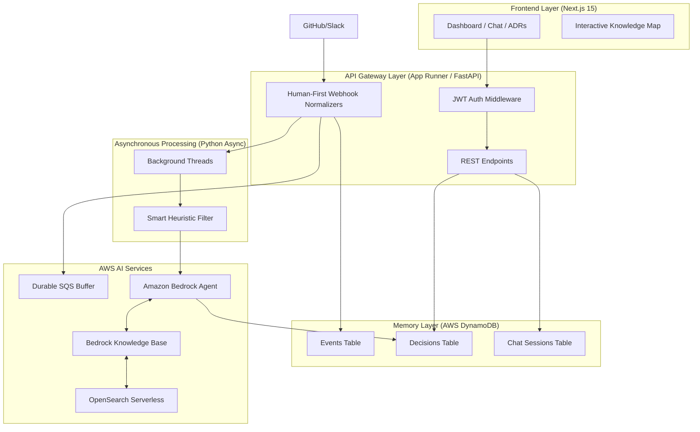

# Memora.dev Technical Documentation
*Version 1.1 — Post-Refinement Implementation Reference*

This document details the actual technical implementation of Memora.dev. It provides a realistic view of the architecture built for the AWS Hackathon, the data flow, and a screen-by-screen functional breakdown of the platform's high-fidelity features.

---

## 1. Architecture Overview 

While the initial design proposed a heavy reliance on AWS Lambda and AWS Step Functions, the actual implementation achieves a more streamlined, lower-latency event-driven AI workflow using **AWS App Runner (FastAPI)**, **Amazon Bedrock Agents**, **AWS SQS**, and **DynamoDB**.

---

## 2. Component Deviations from Initial Design

| Proposed Architecture | Actual Final Implementation | Rationale |
| :--- | :--- | :--- |
| **AWS Lambda** | **FastAPI (App Runner)** | Replaced to eliminate "Cold Starts" and simplify deployment of the long-lived Webhook receiver. |
| **AWS Step Functions** | **Bedrock Agent Orchestration** | Rigid state machines were replaced by the **Bedrock Agent**, which natively handles retrieval, reasoning, and tool selection. |
| **S3 Raw Storage** | **DynamoDB `events` Table** | Normalized JSON payloads are stored directly in DynamoDB for sub-millisecond retrieval in the Activity Feed. |
| **Generic Alerts** | **Embedded Traceability UI** | Replaced browser alerts with a premium "Traceability Trace" view in the Knowledge Graph for a professional demo. |

---

## 3. Data Flow: The "Humanized" Ingest

### 1. Webhook Normalization (The "Human-First" Layer)
*   **Intelligent Titles**: Instead of technical git refs (e.g., `refs/heads/dev`), the system extracts the **actual commit message** or **PR title** to generate human-readable activity feeds.
*   **Snippet Extraction**: Slack messages and PR bodies are truncated into "Understandable Snippets" stored in the `description` field of the Event record.

### 2. Durable Buffer (SQS)
*   Raw events are pushed to **AWS SQS** before AI processing. This ensures that even if Bedrock hits a rate limit or the ingestion service restarts, no architectural decision "evidence" is ever lost.

### 3. Agentic Inference (Bedrock)
*   The system uses **Amazon Bedrock (Nova Lite/Claude 3)** to infer if an event constitutes a "Technical Decision." 
*   **Temporal Metadata**: Every inference is tagged with its source timestamp (`createdAt`), allowing the Knowledge Map to show a chronological evolution of the architecture.

---

## 4. Feature Breakdown

### 1. Knowledge Graph (Architectural Memory)
*   **High-Stability Physics**: Uses a customized D3 simulation with **Velocity Decay (0.65)** and **Alpha Decay (0.06)**. This creates a "heavy," stable feel where nodes don't jitter or fly away during interaction.
*   **Traceability View (Evidence Chain)**: A premium sidebar feature that allows users to trace an AI-inferred decision back to its root sources (e.g., a specific Slack conversation and a following GitHub PR).

### 2. Memora Chat & Session Management
*   **Persistent Context**: Conversations are mapped to unique UUIDs in DynamoDB.
*   **Full Lifecycle Control**: Users can now **permanently delete** old chat sessions, ensuring the architectural workspace remains clean and relevant.

### 3. Activity Feed (Live Pulse)
*   **Understandable Data**: Displays a stream of verified events with prominent human-readable titles, platform icons (GitHub/Slack/Jira), and content previews.
*   **Status Indicators**: Real-time badges show whether an event is `Queued`, `Processed`, or `Flagged` for review.

### 4. Automated ADRs
*   **Git Automation**: Validated decisions trigger a background thread that uses the **GitHub API** to automatically generate a Pull Request containing a formatted Markdown ADR in the target repository.

---

## 5. Deployment Specs
*   **Backend**: FastAPI running on AWS App Runner with VPC access to DynamoDB.
*   **Database**: Amazon DynamoDB (On-Demand) with GSI on `workspace_id`.
*   **AI**: Amazon Bedrock via Boto3 (Agents and Knowledge Base).
*   **Vector DB**: Amazon OpenSearch Serverless (for RAG).
