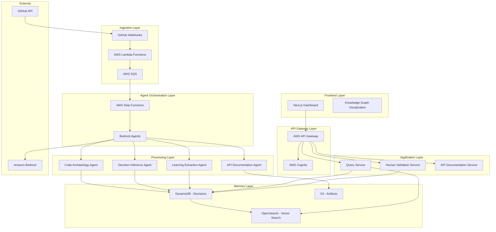
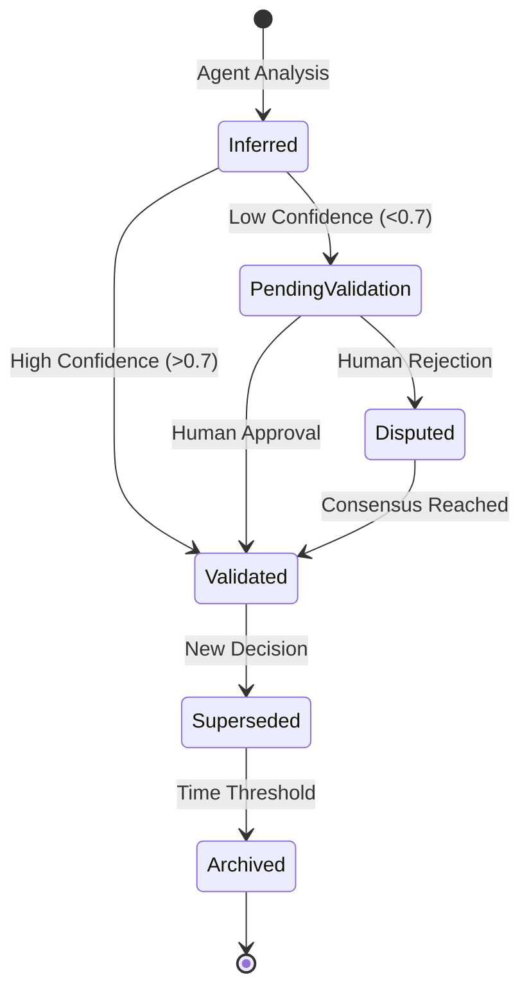

# Design Document

## Overview

Memora.dev is an AI-powered organizational memory platform that transforms how development teams preserve and access institutional knowledge. The system operates as a passive observer of GitHub workflows, using agentic AI to reconstruct decision rationale and build a persistent Decision Knowledge Graph.

The architecture follows an event-driven, microservices approach leveraging AWS cloud services. The system ingests GitHub events via webhooks, processes them through multiple specialized AI agents, stores structured decisions in a knowledge graph, and provides semantic search capabilities through a modern web interface.

Key design principles:
- **Evidence-based**: All decisions must be traceable to source artifacts
- **Confidence-aware**: Every inference includes uncertainty quantification
- **Human-in-the-loop**: Low-confidence decisions require human validation
- **Scalable**: Event-driven architecture supports growing development teams
- **Secure**: Repository-level access controls and encryption throughout

## Architecture

The system follows a layered architecture with clear separation of concerns:



## Components and Interfaces

### Ingestion Layer

**GitHub Webhook Handler**
- Receives GitHub webhook events (PR created, review submitted, commits pushed)
- Validates webhook signatures and filters relevant events
- Queues events for processing via AWS SQS
- Implements rate limiting and duplicate detection

**Event Processing Lambda**
- Processes queued GitHub events
- Enriches events with additional GitHub API data
- Stores raw artifacts in S3 with versioning
- Triggers agent orchestration workflows

**Interfaces:**
```python
class GitHubEvent:
    event_type: str
    repository: str
    pull_request_id: Optional[int]
    commit_sha: Optional[str]
    timestamp: datetime
    payload: Dict[str, Any]

class ArtifactStore:
    def store_artifact(self, artifact: GitHubEvent) -> str
    def retrieve_artifact(self, artifact_id: str) -> GitHubEvent
```

### Agent Orchestration Layer

**AWS Step Functions Orchestrator**
- Coordinates multiple AI agents for decision inference
- Implements retry logic and error handling
- Manages agent dependencies and execution order
- Provides workflow monitoring and observability

**Bedrock Agent Manager**
- Interfaces with Amazon Bedrock for LLM inference
- Manages agent prompts and context windows
- Implements token usage optimization
- Handles model selection and fallback strategies

**Interfaces:**
```python
class AgentOrchestrator:
    def start_workflow(self, event: GitHubEvent) -> str
    def get_workflow_status(self, workflow_id: str) -> WorkflowStatus
    def retry_failed_step(self, workflow_id: str, step_name: str) -> bool

class BedrockAgent:
    def invoke_agent(self, prompt: str, context: Dict) -> AgentResponse
    def get_agent_capabilities(self) -> List[str]
```

### Decision Inference Engine

**Code Archaeology Agent**
- Analyzes code diffs to identify architectural decisions
- Detects patterns indicating design choices (new abstractions, refactoring)
- Extracts technical context from commit messages and PR descriptions
- Assigns significance scores to code changes

**Decision Inference Agent**
- Reconstructs decision rationale from PR discussions and reviews
- Links intent (comments) with execution (code changes)
- Identifies decision authority through approval patterns
- Tracks decision outcomes through follow-up changes

**Learning Extraction Agent**
- Identifies patterns across historical decisions
- Extracts lessons learned and best practices
- Detects recurring architectural debates
- Builds team knowledge profiles

**API Documentation Agent**
- Generates OpenAPI specifications from code analysis
- Creates example requests and responses
- Maintains documentation consistency
- Updates docs automatically on API changes

**Interfaces:**
```python
class DecisionInferenceResult:
    decision_id: str
    confidence_score: float
    evidence_chain: List[Evidence]
    rationale: str
    participants: List[str]

class Agent:
    def analyze(self, context: AnalysisContext) -> DecisionInferenceResult
    def get_confidence_factors(self) -> List[ConfidenceFactor]
```

### Memory Layer

**Decision Entity Storage (DynamoDB)**
- Stores structured Decision_Entities with ACID guarantees
- Supports complex queries on decision attributes
- Implements optimistic locking for concurrent updates
- Provides point-in-time recovery

**Vector Search (OpenSearch)**
- Enables semantic search over decision content
- Maintains embeddings for decisions and artifacts
- Supports hybrid search (keyword + semantic)
- Provides relevance scoring and ranking

**Artifact Storage (S3)**
- Stores raw GitHub artifacts with versioning
- Implements lifecycle policies for cost optimization
- Provides secure access with pre-signed URLs
- Supports cross-region replication

**Interfaces:**
```python
class DecisionStore:
    def save_decision(self, decision: DecisionEntity) -> str
    def get_decision(self, decision_id: str) -> DecisionEntity
    def query_decisions(self, query: DecisionQuery) -> List[DecisionEntity]

class VectorSearch:
    def index_decision(self, decision: DecisionEntity) -> None
    def semantic_search(self, query: str, filters: Dict) -> List[SearchResult]
```

### Query & Retrieval Layer

**Semantic Query Engine**
- Processes natural language queries from developers
- Combines vector search with graph traversal
- Implements query expansion and refinement
- Provides ranked results with confidence scores

**Graph Traversal Service**
- Navigates relationships in the Decision Knowledge Graph
- Finds related decisions and dependencies
- Supports path finding between decisions
- Implements graph algorithms for insight discovery

**Interfaces:**
```python
class QueryEngine:
    def process_query(self, query: str, context: QueryContext) -> QueryResult
    def expand_query(self, query: str) -> List[str]
    def rank_results(self, results: List[SearchResult]) -> List[SearchResult]

class GraphTraversal:
    def find_related_decisions(self, decision_id: str) -> List[DecisionEntity]
    def find_decision_path(self, start_id: str, end_id: str) -> List[DecisionEntity]
```

### Frontend Layer

**Next.js Dashboard**
- Provides responsive web interface for decision exploration
- Implements real-time updates via WebSocket connections
- Supports advanced filtering and search capabilities
- Includes user preference management

**Knowledge Graph Visualization**
- Interactive D3.js-based graph visualization
- Supports zooming, panning, and node selection
- Implements force-directed layout algorithms
- Provides customizable node and edge styling

**Interfaces:**
```typescript
interface DashboardAPI {
  searchDecisions(query: string): Promise<DecisionEntity[]>
  getDecisionGraph(filters: GraphFilters): Promise<GraphData>
  validateDecision(decisionId: string, feedback: ValidationFeedback): Promise<void>
}

interface GraphVisualization {
  renderGraph(data: GraphData): void
  updateLayout(algorithm: LayoutAlgorithm): void
  highlightPath(path: string[]): void
}
```

## Data Models

### Decision Entity

The core data structure representing a development decision:

```python
@dataclass
class DecisionEntity:
    # Identity
    decision_id: str
    repository: str
    created_at: datetime
    updated_at: datetime
    
    # Decision Content
    title: str
    description: str
    rationale: str
    alternatives_considered: List[str]
    
    # Evidence Chain
    intent: List[Evidence]  # PR descriptions, comments, discussions
    execution: List[Evidence]  # Code diffs, commits
    authority: List[Evidence]  # Approvals, reviewers
    outcomes: List[Evidence]  # Follow-up changes, reverts
    
    # Metadata
    confidence_score: float
    validation_status: ValidationStatus
    participants: List[str]
    tags: List[str]
    
    # Relationships
    related_decisions: List[str]
    superseded_by: Optional[str]
    supersedes: Optional[str]

@dataclass
class Evidence:
    source_type: str  # "pr_comment", "commit", "review", "code_diff"
    source_id: str
    content: str
    author: str
    timestamp: datetime
    confidence_contribution: float
```

### Graph Relationships

```python
@dataclass
class DecisionRelationship:
    source_decision_id: str
    target_decision_id: str
    relationship_type: str  # "depends_on", "conflicts_with", "extends", "reverts"
    strength: float  # 0.0 to 1.0
    evidence: List[Evidence]
```

### Confidence Scoring Model

```python
@dataclass
class ConfidenceScore:
    overall_score: float  # 0.0 to 1.0
    factors: Dict[str, float]  # Factor name -> contribution
    
    # Factor breakdown
    evidence_quality: float
    evidence_quantity: float
    participant_authority: float
    temporal_consistency: float
    outcome_validation: float

@dataclass
class ConfidenceFactor:
    name: str
    weight: float
    value: float
    explanation: str
```

## Decision Lifecycle Modeling

### Decision States

```python
class DecisionStatus(Enum):
    INFERRED = "inferred"  # AI-generated, not validated
    VALIDATED = "validated"  # Human-confirmed
    DISPUTED = "disputed"  # Human disagreement
    SUPERSEDED = "superseded"  # Replaced by newer decision
    ARCHIVED = "archived"  # Historical, no longer relevant
```

### Lifecycle Transitions

1. **Ingestion → Inference**: GitHub events trigger agent analysis
2. **Inference → Storage**: Decisions stored with confidence scores
3. **Storage → Validation**: Low-confidence decisions queued for review
4. **Validation → Update**: Human feedback updates decision and confidence
5. **Update → Notification**: Stakeholders notified of changes

### State Machine



## Confidence Scoring Strategy

### Multi-Factor Scoring

Confidence scores combine multiple factors with learned weights:

1. **Evidence Quality (30%)**
   - Source credibility (senior developers weighted higher)
   - Content depth and specificity
   - Technical accuracy assessment

2. **Evidence Quantity (20%)**
   - Number of supporting artifacts
   - Discussion thread length
   - Review participation level

3. **Participant Authority (25%)**
   - GitHub repository permissions
   - Historical decision accuracy
   - Domain expertise indicators

4. **Temporal Consistency (15%)**
   - Time between discussion and implementation
   - Consistency across related decisions
   - Absence of contradictory evidence

5. **Outcome Validation (10%)**
   - Follow-up changes supporting the decision
   - Absence of reverts or corrections
   - Long-term stability indicators

### Confidence Calibration

The system continuously calibrates confidence scores against human validation:

```python
class ConfidenceCalibrator:
    def update_weights(self, validation_feedback: List[ValidationResult]) -> None
        """Update factor weights based on validation accuracy"""
        
    def predict_validation_outcome(self, decision: DecisionEntity) -> float
        """Predict likelihood of human validation"""
        
    def adjust_threshold(self, target_precision: float) -> float
        """Adjust validation threshold for desired precision"""
```

## Human-in-the-Loop Flow

### Validation Workflow

1. **Trigger Conditions**
   - Confidence score below threshold (default 0.7)
   - Conflicting evidence detected
   - High-impact decisions (architectural changes)
   - User-requested validation

2. **Reviewer Selection**
   - Repository maintainers prioritized
   - Domain experts identified from commit history
   - Load balancing across available reviewers
   - Escalation for unresponded requests

3. **Validation Interface**
   - Side-by-side evidence presentation
   - Confidence factor breakdown
   - Suggested improvements
   - Binary approve/reject with comments

4. **Feedback Integration**
   - Decision updates based on human input
   - Confidence model retraining
   - Evidence weight adjustments
   - Notification to decision stakeholders

### Validation Task Management

```python
@dataclass
class ValidationTask:
    task_id: str
    decision_id: str
    assigned_reviewer: str
    created_at: datetime
    due_date: datetime
    priority: Priority
    status: ValidationTaskStatus
    
class ValidationTaskManager:
    def create_task(self, decision: DecisionEntity) -> ValidationTask
    def assign_reviewer(self, task: ValidationTask) -> str
    def escalate_overdue(self, task: ValidationTask) -> None
    def process_feedback(self, task: ValidationTask, feedback: ValidationFeedback) -> None
```

## Error Handling

### Failure Categories

1. **Ingestion Failures**
   - GitHub API rate limits
   - Webhook delivery failures
   - Malformed event payloads
   - Network connectivity issues

2. **Processing Failures**
   - LLM service unavailability
   - Agent timeout errors
   - Memory allocation issues
   - Invalid inference results

3. **Storage Failures**
   - Database connection errors
   - Consistency violations
   - Capacity limitations
   - Backup/recovery issues

### Recovery Strategies

```python
class ErrorHandler:
    def handle_ingestion_error(self, error: IngestionError) -> RecoveryAction
        """Implement exponential backoff and dead letter queues"""
        
    def handle_processing_error(self, error: ProcessingError) -> RecoveryAction
        """Retry with different models or skip non-critical steps"""
        
    def handle_storage_error(self, error: StorageError) -> RecoveryAction
        """Implement circuit breakers and graceful degradation"""
```

### Monitoring and Alerting

- **Health Checks**: Endpoint monitoring for all services
- **Performance Metrics**: Latency, throughput, error rates
- **Business Metrics**: Decision inference accuracy, validation rates
- **Alert Thresholds**: Configurable limits with escalation policies

## Testing Strategy

The system requires comprehensive testing across multiple dimensions to ensure reliability and accuracy of AI-generated insights.

**Dual Testing Approach**:
- **Unit tests**: Verify specific examples, edge cases, and error conditions for individual components
- **Property tests**: Verify universal properties across all inputs using randomized testing
- Both approaches are complementary and necessary for comprehensive coverage

**Unit Testing Focus**:
- Specific examples demonstrating correct behavior
- Integration points between components (API contracts, data transformations)
- Edge cases and error conditions (malformed GitHub events, API failures)
- Authentication and authorization flows

**Property Testing Focus**:
- Universal properties that hold for all inputs (data consistency, confidence score bounds)
- Comprehensive input coverage through randomization
- System invariants under various conditions

**Property-Based Testing Configuration**:
- Minimum 100 iterations per property test due to randomization
- Each property test references its corresponding design document property
- Tag format: **Feature: memora-dev-ai-memory-os, Property {number}: {property_text}**
- Use Hypothesis (Python) for backend property testing
- Use fast-check (TypeScript) for frontend property testing

## Correctness Properties

*A property is a characteristic or behavior that should hold true across all valid executions of a system—essentially, a formal statement about what the system should do. Properties serve as the bridge between human-readable specifications and machine-verifiable correctness guarantees.*

Based on the prework analysis and property reflection, the following properties ensure system correctness:

### Property 1: Complete Data Ingestion
*For any* GitHub event (PR creation, code review, or commit), the Ingestion_System should capture all required metadata, content, and relationships, and store them in the Memory_Layer with proper versioning.
**Validates: Requirements 2.1, 2.2, 2.3, 2.5**

### Property 2: Decision Entity Completeness
*For any* Decision_Entity created by the system, it should contain all required structured fields (intent, execution, authority, outcomes) with valid data types and non-empty evidence chains.
**Validates: Requirements 3.3, 4.1**

### Property 3: Agent Decision Identification
*For any* code change or PR discussion processed by agents, if architectural significance is detected, a Decision_Entity should be created with extracted rationale and proper agent attribution.
**Validates: Requirements 3.1, 3.2**

### Property 4: Confidence Score Consistency
*For any* decision inference, the assigned confidence score should be between 0.0 and 1.0, include detailed factor breakdowns, and be displayed with all decision information.
**Validates: Requirements 3.4, 5.3, 12.5**

### Property 5: Validation Threshold Triggering
*For any* Decision_Entity with a confidence score below 0.7, a validation task should be created for human review within the specified time threshold.
**Validates: Requirements 3.5, 8.1**

### Property 6: Graph Relationship Bidirectionality
*For any* relationship created between decisions in the Decision_Knowledge_Graph, the inverse relationship should exist, and both should maintain consistent metadata.
**Validates: Requirements 4.2, 4.3**

### Property 7: Decision Versioning Preservation
*For any* Decision_Entity that receives new evidence, a new version should be created while preserving all previous versions and maintaining version history integrity.
**Validates: Requirements 4.4**

### Property 8: ACID Transaction Guarantees
*For any* decision storage operation, the Memory_Layer should maintain atomicity, consistency, isolation, and durability properties even under concurrent access.
**Validates: Requirements 4.5**

### Property 9: Query Response Completeness
*For any* semantic search query, all returned results should include evidence-backed answers with complete traceability chains to source artifacts.
**Validates: Requirements 5.1, 5.2**

### Property 10: Performance Response Times
*For any* system operation (event processing, query response, notification delivery), the response time should meet the specified SLA thresholds under normal load conditions.
**Validates: Requirements 2.4, 5.5, 8.5, 10.4**

### Property 11: Graph Visualization Data Completeness
*For any* graph visualization request, the rendered data should include all required node types (decisions, artifacts, team members) and support the specified filtering operations.
**Validates: Requirements 6.2, 6.3**

### Property 12: API Documentation Completeness
*For any* public API endpoint, the generated documentation should include OpenAPI specifications, interactive examples, authentication requirements, rate limiting information, and SDK examples for common languages.
**Validates: Requirements 7.1, 7.2, 7.4, 7.5**

### Property 13: Documentation Synchronization
*For any* API endpoint change, the documentation should be automatically updated to reflect the changes within the specified time window.
**Validates: Requirements 7.3**

### Property 14: Human Validation Flow Completeness
*For any* validation task created, the interface should present all required evidence, proposed inference, and feedback mechanisms, and process human feedback by updating entities and retraining models.
**Validates: Requirements 8.2, 8.3**

### Property 15: Validation Accuracy Tracking
*For any* validation feedback received, the system should update accuracy metrics and adjust confidence thresholds to maintain target precision levels.
**Validates: Requirements 8.4**

### Property 16: Authorization Enforcement
*For any* user attempting to access decisions, the system should verify GitHub OAuth authentication, enforce repository-level permissions, and only allow access to authorized content.
**Validates: Requirements 9.1, 9.2, 9.3**

### Property 17: Encryption Requirements
*For any* data transmission or storage operation, the system should use TLS 1.3 for data in transit and AES-256 encryption for sensitive data at rest.
**Validates: Requirements 9.4, 9.5**

### Property 18: Concurrent Processing Capacity
*For any* load scenario within specified limits (1000 webhook events/minute, 100 concurrent PR analyses), the system should process all requests successfully without degradation.
**Validates: Requirements 10.1, 10.2**

### Property 19: Monitoring and Health Checks
*For any* major system component, health check endpoints should exist and return accurate status information, with monitoring systems providing alerts for performance degradation.
**Validates: Requirements 10.5, 11.3**

### Property 20: Error Handling and Recovery
*For any* system failure (GitHub API errors, agent processing failures, data corruption), the system should implement appropriate recovery strategies (exponential backoff, error logging, isolation) and continue operation.
**Validates: Requirements 11.1, 11.2, 11.4**

### Property 21: Explainability and Traceability
*For any* decision inference, the system should provide detailed explanations, show evidence chains, indicate contributing agents, and maintain traceability links to original source artifacts.
**Validates: Requirements 12.1, 12.2, 12.3, 12.4**